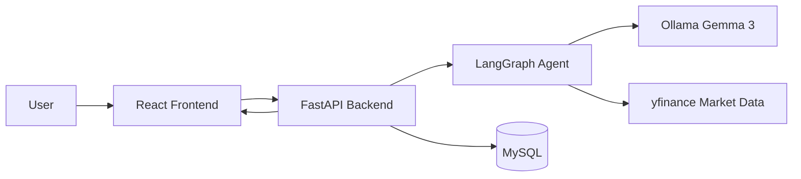

# TradeBuddy

TradeBuddy is a full-stack AI stock analysis assistant built to help users ask natural-language questions about public companies and receive structured market insights in return. It combines a React chat interface, a Python FastAPI backend, live market-data lookup, and persistent conversation logging to create a practical AI-driven finance experience.

## Why this project stands out

- Natural-language stock discovery instead of rigid ticker-only queries
- Hybrid ticker resolution using company aliases, symbol matching, and fallback lookup
- Live market-data enrichment with `yfinance`
- AI reasoning pipeline powered by `Gemma 3` through Ollama
- Conversation persistence with MySQL
- Modern product-style frontend with chat history and new-chat support

## Product Overview

TradeBuddy is designed like a focused AI product, not just a demo chatbot. A user can type questions such as:

- "Should I buy HDFC Bank?"
- "Tell me about Infosys"
- "What is the outlook for FirstCry?"
- "Can you analyze Apple stock?"

The system identifies the company, fetches available market data, and returns a structured response with:

- market valuation breakdown
- ratio analysis
- actionable insights and strategy
- support and resistance lookouts

If ticker detection is unclear, the assistant asks for clarification instead of guessing, which improves reliability and user trust.

## Tech Stack

- Frontend: React, React Scripts, Lucide icons
- Backend: FastAPI, LangGraph, LangChain, Ollama
- Market Data: `yfinance`
- Database: MySQL with SQLAlchemy
- AI Model: `Gemma 3:4B`

## Core Features

- Chat-based stock analysis workflow
- Auto-detection of company names and stock symbols
- Fallback handling for Indian and US tickers
- Live price, P/E ratio, and moving-average context
- Persistent chat logs in MySQL
- Clean chat history UI with `New chat`
- CORS-enabled backend for local development and deployment

## Architecture



## How It Works

1. The user enters a stock or company query in the chat UI.
2. The frontend sends the message to the backend `/api/chat` endpoint.
3. The backend resolves the ticker using company aliases and fallback rules.
4. Live market data is fetched from `yfinance`.
5. The AI agent generates a structured analytical response.
6. The conversation is saved to MySQL and returned to the frontend.

## Local Development Setup

### Frontend

```powershell
cd frontend
npm install
npm start
```

### Backend

```powershell
cd backend
python main.py
```

## Environment Requirements

- Python 3.10+ recommended
- Node.js 18+ recommended
- MySQL running locally
- Ollama installed locally
- `Gemma 3:4B` model available in Ollama

## Backend API

### `POST /api/chat`

Request:

```json
{
  "message": "Should I buy HDFC Bank?"
}
```

Response:

```json
{
  "status": "success",
  "ticker_detected": "HDFCBANK.NS",
  "response": "..."
}
```

## Deployment Notes

- The frontend can be deployed on Netlify or Vercel.
- The backend is better suited for Render or Railway.
- For production, update the frontend API URL to point to the deployed backend.

## Project Value

TradeBuddy demonstrates:

- AI product design
- data enrichment and fallback handling
- backend API design
- stateful conversation UX
- integration between frontend, backend, and database

## Future Improvements

- Watchlist and portfolio tracking
- User authentication
- Better ticker disambiguation
- Charting and technical indicators
- Sentiment analysis from news and earnings reports
- Deeper personalization based on user history


TradeBuddy is a good example of combining AI, finance data, and product thinking into a single user-facing experience.
